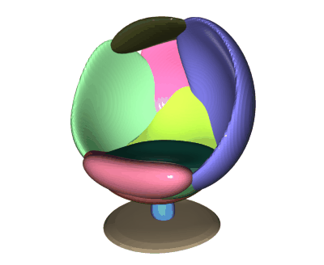
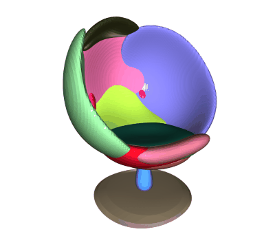

# 3DIAS_Pytorch
This repository contains the official code to reproduce the results from the paper

**3DIAS: 3D Shape Reconstruction with Implicit Algebraic Surfaces (ICCV 2021)**

\[[project page](https://myavartanoo.github.io/3dias/)\] \[[arXiv](https://arxiv.org/abs/2108.08653)\] \[[presentation](https://www.youtube.com/watch?v=f_DYAwdkUa4&list=PLhCEMvtuQ92VjjKVfnUUaSFJGJJXM2ulN)\] 

<p align="center">
  
  
</p>


## Installation
Clone this repository into any place you want.
```
git clone https://github.com/myavartanoo/3DIAS_PyTorch.git
cd 3DIAS_Pytorch
```

### Dependencies
* Python 3.8.5
* PyTorch 1.7.1
* numpy
* Pillow
* open3d
* torchmcubes 0.1.0 (see this [repo](https://github.com/tatsy/torchmcubes))

Install dependencies in a conda environment.
```
conda create -n 3dias python=3.8
conda activate 3dias

pip install -r requirements.txt
```

### Pretrained model
Download `config.json` and `checkpoint-epoch#.pth` from below links and save in `weigths` folder.
Note that we get `Multi-class` weight by training with all-classes and `Single-class` weight by training with each class
### NOTE: The pretrained model is updated at Dec. 31th 2021. 


#### Multi-class
<!-- [Dropbox](https://www.dropbox.com/sh/z7ccstte6i69jju/AABaaCJ9LgKw-JT1Mdf0Tz-ta?dl=0) --->
> [Multi-class](http://data.cv.snu.ac.kr:8008/webdav/dataset/3DIAS/multi_class.zip)

#### Single-class
To download all the single-class weigths, run
```
sh download_weights.sh
```

Or you can get the weights one-by-one.
> [airplane](http://data.cv.snu.ac.kr:8008/webdav/dataset/3DIAS/single_class/02691156_airplane.zip) / [bench](http://data.cv.snu.ac.kr:8008/webdav/dataset/3DIAS/single_class/02828884_bench.zip) / [cabinet](http://data.cv.snu.ac.kr:8008/webdav/dataset/3DIAS/single_class/02933112_cabinet.zip) / [car](http://data.cv.snu.ac.kr:8008/webdav/dataset/3DIAS/single_class/02958343_car.zip) / [chair](http://data.cv.snu.ac.kr:8008/webdav/dataset/3DIAS/single_class/03001627_chair.zip) / [display](http://data.cv.snu.ac.kr:8008/webdav/dataset/3DIAS/single_class/03211117_display.zip) / [lamp](http://data.cv.snu.ac.kr:8008/webdav/dataset/3DIAS/single_class/03636649_lamp.zip) / [speaker](http://data.cv.snu.ac.kr:8008/webdav/dataset/3DIAS/single_class/03691459_speaker.zip) / [rifle](http://data.cv.snu.ac.kr:8008/webdav/dataset/3DIAS/single_class/04090263_rifle.zip) / [sofa](http://data.cv.snu.ac.kr:8008/webdav/dataset/3DIAS/single_class/04256520_sofa.zip) / [table](http://data.cv.snu.ac.kr:8008/webdav/dataset/3DIAS/single_class/04379243_table.zip) / [phone](http://data.cv.snu.ac.kr:8008/webdav/dataset/3DIAS/single_class/04401088_phone.zip) / [vessel](http://data.cv.snu.ac.kr:8008/webdav/dataset/3DIAS/single_class/04530566_vessel.zip)


## Quickstart (Demo)
<p align="center">
  
</p>

You can now test our demo code on the provided input images in the `input` folder. (Or you can use other images in shapeNet.)
To this end, simply run, 
```
python demo.py --device "0" --inputimg "./input/<image_name>.png" --config "./weights/config.json" --resume "./weights/checkpoint-epoch890.pth" 
```
The result meshes are saved in `output` folder. (We've created a few example meshes)
* total.ply is a whole mesh
* parts_<number>.ply are meshes for parts
To see the mesh, you can use [meshlab](https://www.meshlab.net/)

If you want to visualize meshes with open3d, run with `--visualize` option as below.
```
python demo.py --device "0" --inputimg "./input/<image_name>.png" --config "./weights/config.json" --resume "./weights/checkpoint-epoch890.pth" --visualize
```

The preprocessed dataset, training, testing code will be distributed soon.


## (Preprocessed) Dataset
- Dowload below two zip files and unzip in `data` folder. [images](http://data.cv.snu.ac.kr:8008/webdav/dataset/3DIAS/images.zip) and [newDataPoints](http://data.cv.snu.ac.kr:8008/webdav/dataset/3DIAS/newDataPoints.zip)
- `metadata.csv` contains the number of data for each class. If you want to train a specific class, use other csv file like in `metadata_03001627` for chair only

## Train
To run the training code, 
```
python train.py --device "0" --config config.json --tag "exp_name"
```
Note that,
1. the log and model will be saved at `trainer/save_dir` in `config.json`. **You MUST change this to your own path**
2. `--tag` is for the name of experiment

### GPU memory issue
There is large tensor product in PI_funcs_generator() line 13,
> PI_funcs = (coeff.unsqueeze(dim=1) * I.unsqueeze(dim=3)).sum(dim=2)\

We can handle the tensor product since we use **Quadro RTX 8000 (48GB VRAM)** 
There might be two solutions for the product of large tensors in the GPUs with small memory.
1. Reduce the `batch_size` in `data_loader` in `config.json`
2. Use for-loop, do iteratively summation 
3. Use DDP (I didn't test this)


## Test
To run the test code, select the options `config.json` and `checkpoint-epoch###.pth` for the specific experiment.
```
python test.py --device "0" --config /path/to/saved_config/config.json --resume "/path/to/saved_model/checkpoint-epoch###.pth" --tag "exp_name"
```
In test code, `--tag` is just used as the **name** of the folder where the result will be saved.

## Citation
If you find our code or paper useful, please consider citing

    @inproceedings{3DIAS,
        title = {3DIAS: 3D Shape Reconstruction with Implicit Algebraic Surfaces},
        author = {Mohsen Yavartanoo, JaeYoung Chung, Reyhaneh Neshatavar, Kyoung Mu Lee},
        booktitle = {Proceedings IEEE Conf. on International Conference on Computer Vision (ICCV)},
        year = {2021}
    }
